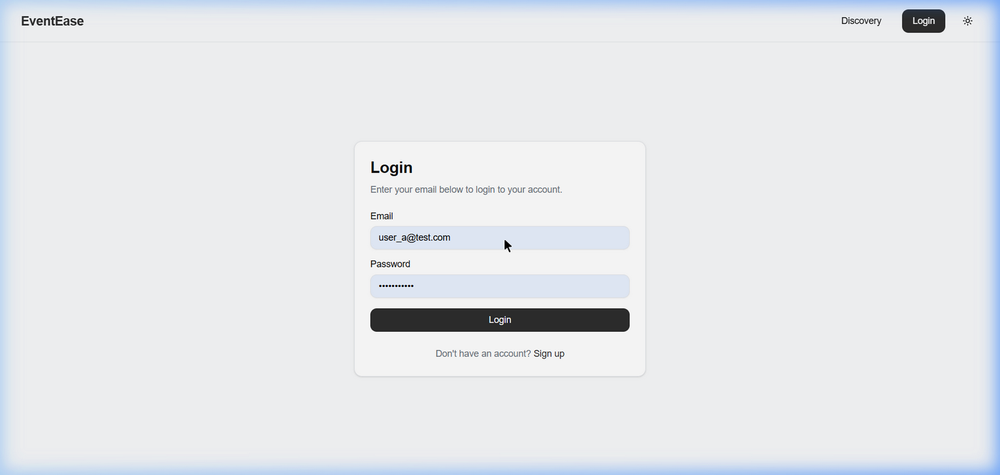
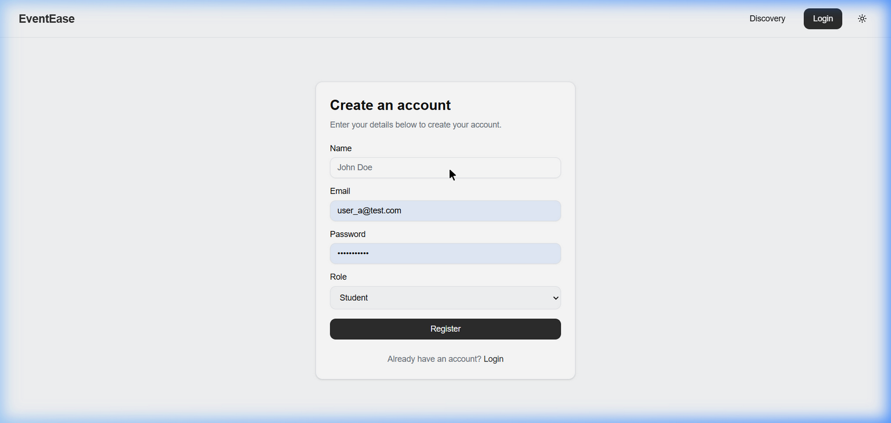
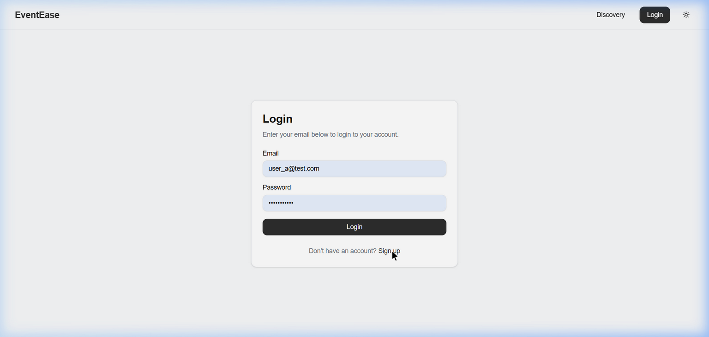
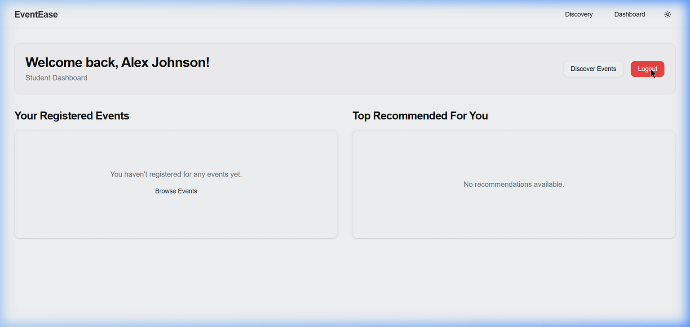
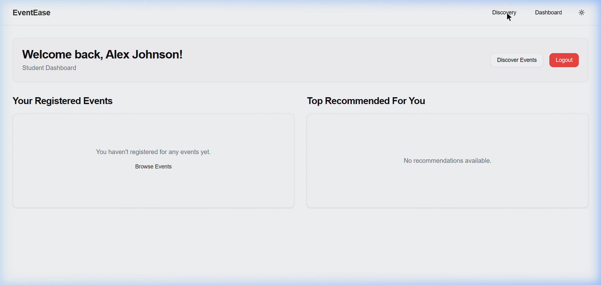
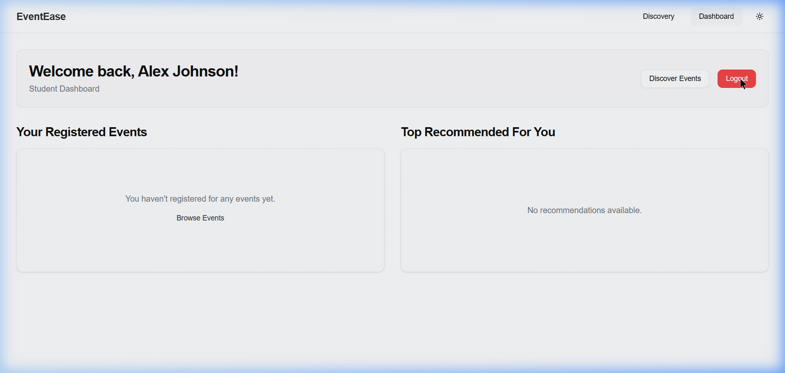
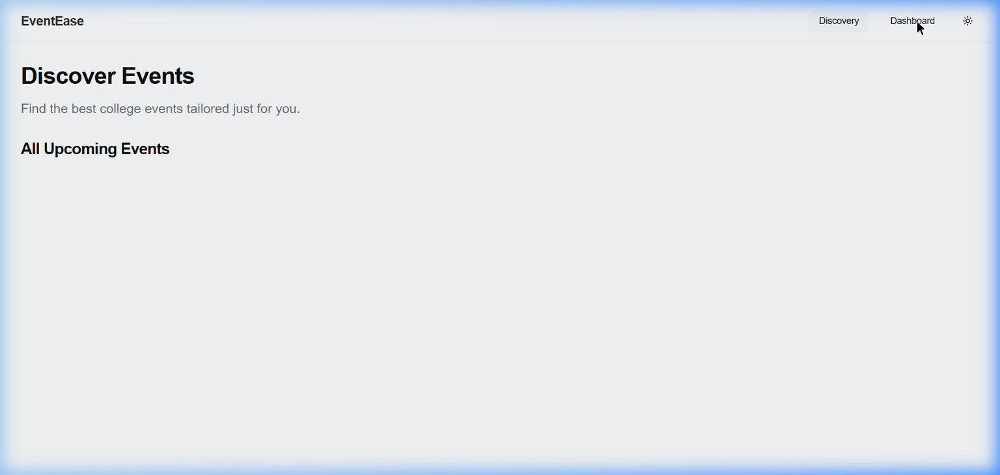
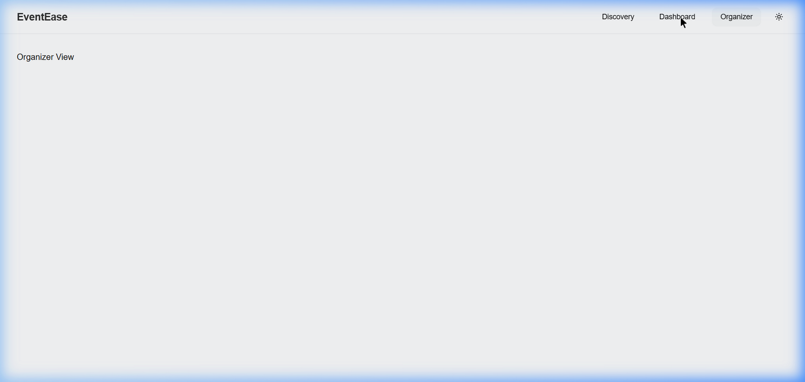
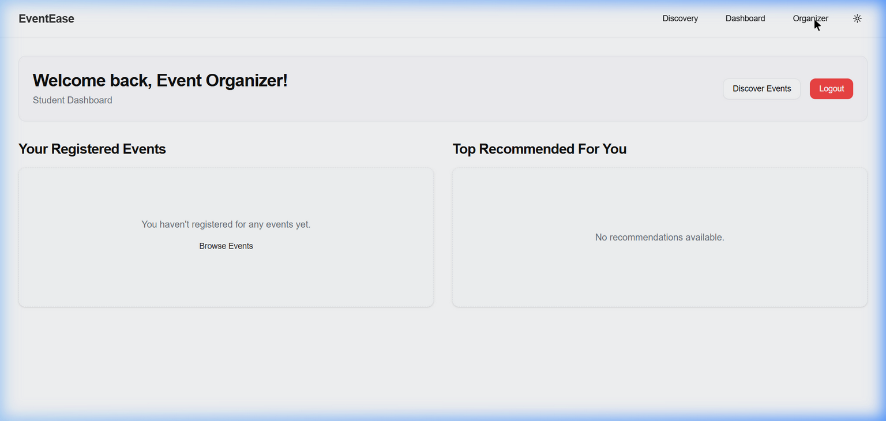

<div align="center">


# EventEase

**AI-Powered Event Recommendation & Real-Time Visualization Platform**

[](https://react.dev/)
[](https://www.typescriptlang.org/)
[](https://nodejs.org/)
[](https://www.mongodb.com/atlas)
[](https://socket.io/)
[](https://eeventease-api.onrender.com)

<p>
  <a href="#-overview">Overview</a> •
  <a href="#-platform-screenshots">Screenshots</a> •
  <a href="#-key-features">Features</a> •
  <a href="#-tech-stack">Tech Stack</a> •
  <a href="#-architecture">Architecture</a> •
  <a href="#-installation--setup">Setup</a> •
  <a href="#-api-reference">API</a> •
  <a href="#-security">Security</a>
</p>

</div>

---

## 📊 Project Statistics

<div align="center">

| Metric | Value |
|--------|-------|
| 🗂️ Total Source Files | **74** |
| 📝 Lines of Code | **9,028+** |
| ⚛️ React Components | **22** |
| 📄 Application Pages | **11** |
| 🔌 API Controllers | **6** |
| 🛣️ API Route Modules | **7** |
| 🗃️ Database Models | **5** |
| 🤖 AI Model | **Groq Llama-3.3-70B** |
| ⚡ Real-time Engine | **Socket.IO** |
| ☁️ Media CDN | **ImageKit.io** |

</div>

---

## 🎯 Overview

**EventEase** is a production-grade, full-stack AI-driven event discovery and real-time social platform built for university campuses. It intelligently connects students with relevant events by analyzing their interests, historical engagement, and behavioral trends using **Groq's Llama-3** large language model.

Beyond discovery, EventEase delivers a fully featured social hub with:
- 🤖 **Explainable AI recommendations** with transparent reasoning
- 💬 **Real-time 1:1 and group messaging** powered by Socket.IO
- 📊 **Interactive data visualizations** — radar charts, bar graphs, trend maps
- 🎫 **End-to-end event lifecycle** management for organizers
- 🔐 **Production-grade security** with dual-token JWT architecture

> 🚀 **Live Backend:** [https://eeventease-api.onrender.com](https://eeventease-api.onrender.com)

---

## 📸 Platform Screenshots

### 🔐 Authentication Flow

| Login Page | Registration Page |
|:---:|:---:|
|  |  |
| *Clean auth form with credential validation* | *Role-based registration — Student or Organizer* |

---

### 🔍 Event Discovery

| Unauthenticated Discovery | Authenticated Discovery |
|:---:|:---:|
|  |  |
| *Public event browsing without account* | *Personalized AI-powered event feed for logged-in users* |

| Discovery with Live Events | Navigation Bar |
|:---:|:---:|
|  |  |
| *Real event cards with registration, capacity, and interest tags* | *Role-aware navbar — shows Organizer panel for event creators* |

---

### 🎓 Student Dashboard

| Student Dashboard | Student Dashboard (Personalized) |
|:---:|:---:|
|  |  |
| *Registered events, AI recommendations, and engagement overview* | *Personalized feed — "Top Recommended For You"* |

---

### 🛠️ Organizer Command Center

| Organizer Control Panel |
|:---:|
|  |
| *Full event management: Create, monitor registrations, manage attendees, and **Close Events** to mark completion* |

> 💡 **New Feature:** The organizer dashboard includes a **"Close Event"** button on each active event card. Clicking it opens a confirmation dialog and calls `PATCH /api/events/:id/close`, updating the event status to `completed` in real time.

---

## ✨ Key Features

### 🧠 AI-Powered Curation & Analytics
- **Weighted Match Scoring** — Intelligent ranking based on user interests, engagement patterns, and registration velocity
- **Explainable AI (XAI)** — Groq/Llama-3 generates human-readable explanations for *why* each event was recommended
- **Dynamic Radar Charts** — Visual interest alignment mapping across categories using Recharts
- **Trend Analysis** — Organizer-level attendee interest distribution visualized in bar charts
- **Fallback Key Rotation** — Automatic API key failover on rate-limit (HTTP 429) for zero-downtime AI

### 💬 Real-Time Social Engine
- **Socket.IO Messaging** — Instant peer-to-peer and group communication with <50ms latency
- **Auto-Generated Event Channels** — Every event automatically gets **Discussion** and **Announcement** channels
- **Read Receipts (Blue Ticks)** — WhatsApp-style message read confirmation for group chats
- **Social Graph** — "People You May Know" suggestions based on overlapping interest graphs
- **Follow System** — Interest-gated 1:1 messaging (only mutual followers can DM)

### 🎫 Event Lifecycle Management
- **Full CRUD** — Create, update, delete events with rich metadata (tags, capacity, categories)
- **Close Event** — Organizers can finalize events as `completed`, triggering attendee notifications
- **Blacklist System** — Organizers can remove and ban specific attendees from their events
- **Live Registration Tracking** — Real-time attendee count updates
- **Dual-Mode Media** — ImageKit cloud uploads or external URL banners

### 🎨 Premium UI/UX
- **Glassmorphism Design** — Frosted glass cards with backdrop-blur throughout
- **Framer Motion** — Page transitions, list animations, and micro-interactions
- **Dark/Light Mode** — System-aware theme toggle
- **Responsive Layout** — Mobile-first architecture scaling from 375px to 4K
- **Interest Onboarding** — Multi-step interest curation wizard post-registration

### 🛡️ Security Architecture
- **Dual-Token Auth** — Short-lived JWT access tokens (15min) + HttpOnly refresh tokens (7d)
- **Refresh Promise Lock** — Prevents concurrent token refresh races during network instability
- **XSS Protected** — Refresh tokens never exposed to client-side JavaScript
- **CORS Hardened** — Origin-reflection with dynamic allowlist for multi-domain deployments
- **bcryptjs Password Hashing** — Industry-standard salt+hash for all credentials

---

## 💻 Tech Stack

### Frontend
| Technology | Version | Purpose |
|------------|---------|---------|
| **React** | 19 | Core UI framework |
| **Vite** | 6.x | Build tool & dev server |
| **TypeScript** | 5.x | Type safety |
| **Tailwind CSS** | v4 | Utility-first styling |
| **Framer Motion** | 12.x | Animations & transitions |
| **Redux Toolkit** | 2.x | Global state management |
| **Recharts** | 2.x | Data visualization |
| **Socket.IO Client** | 4.x | Real-time communication |
| **Lucide React** | latest | Icon library |
| **shadcn/ui** | latest | Accessible UI components |

### Backend
| Technology | Version | Purpose |
|------------|---------|---------|
| **Node.js** | 20 LTS | Runtime environment |
| **Express.js** | 4.x | HTTP framework |
| **TypeScript** | 5.x | Type-safe server code |
| **MongoDB Atlas** | 7.x | Primary database |
| **Mongoose** | 8.x | ODM layer |
| **Socket.IO** | 4.x | WebSocket server |
| **Groq SDK** | latest | Llama-3 AI integration |
| **ImageKit** | 5.x | Cloud media storage & CDN |
| **JWT + bcryptjs** | — | Authentication & security |
| **Multer** | 1.x | File upload middleware |

### Infrastructure & Deployment
| Service | Purpose |
|---------|---------|
| **Render** | Backend hosting (Node.js) |
| **Vercel** | Frontend hosting (React SPA) |
| **MongoDB Atlas** | Managed database (M0 free tier) |
| **ImageKit.io** | Media CDN & transformation |
| **GitHub** | Version control & CI/CD |

---

## 🏗️ Architecture

```
┌─────────────────────────────────────────────────────────────────┐
│                         FRONTEND (Vercel)                        │
│  React 19 + Vite + TypeScript + Tailwind CSS v4 + Redux Toolkit │
│                                                                   │
│  ┌─────────────┐  ┌──────────────┐  ┌───────────────────────┐   │
│  │  Discovery  │  │   Dashboard  │  │  Organizer Dashboard  │   │
│  │  (AI Feed)  │  │  (Student)   │  │  (Event Management)   │   │
│  └─────────────┘  └──────────────┘  └───────────────────────┘   │
│  ┌─────────────┐  ┌──────────────┐  ┌───────────────────────┐   │
│  │   Profile   │  │     Chat     │  │    Event Details      │   │
│  │  (Social)   │  │  (Socket.IO) │  │    (AI Insights)      │   │
│  └─────────────┘  └──────────────┘  └───────────────────────┘   │
└───────────────────────────┬─────────────────────────────────────┘
                            │  REST API (HTTPS) + WebSocket (WSS)
                            ▼
┌─────────────────────────────────────────────────────────────────┐
│                         BACKEND (Render)                         │
│               Node.js + Express.js + TypeScript                  │
│                                                                   │
│  ┌────────────┐  ┌──────────┐  ┌──────────┐  ┌─────────────┐   │
│  │   Auth     │  │  Events  │  │  Users   │  │    Chat     │   │
│  │Controller  │  │Controller│  │Controller│  │  Controller │   │
│  └────────────┘  └──────────┘  └──────────┘  └─────────────┘   │
│                                                                   │
│  ┌────────────────────────────────────────────────────────────┐  │
│  │               Socket.IO Real-Time Engine                    │  │
│  │  Private Rooms · Group Event Channels · Read Receipts       │  │
│  └────────────────────────────────────────────────────────────┘  │
│                                                                   │
│  ┌─────────────────┐  ┌────────────────────────────────────────┐ │
│  │  Groq AI Layer  │  │        MongoDB Atlas                    │ │
│  │  Llama-3.3-70B  │  │  Users · Events · Messages · Chats     │ │
│  │  + Key Failover │  └────────────────────────────────────────┘ │
│  └─────────────────┘                                              │
└─────────────────────────────────────────────────────────────────┘
```

### Database Models

| Model | Key Fields |
|-------|-----------|
| **User** | name, email, role (user/organizer), interests[], followers[], following[], bio, profileImage |
| **Event** | title, date, location, organizer, registeredAttendees[], status (upcoming/ongoing/completed/cancelled), posterUrl, capacity |
| **Message** | sender, content, chat, readBy[], createdAt |
| **Chat** | participants[], isGroupChat, event, latestMessage, type (discussion/announcement) |
| **Notification** | recipient, type, content, read, createdAt |

---

## 🚀 Installation & Setup

### Prerequisites
- Node.js v18+
- npm v9+
- MongoDB Atlas account (free M0 tier works)
- Groq API key ([free tier available](https://console.groq.com))
- ImageKit account ([free tier available](https://imagekit.io))

### 1. Clone the Repository
```bash
git clone https://github.com/Purushotham-Prajapati-24/EEventEase-AI-Based-Event-Recommendation-Visualization-System.git
cd EEventEase-AI-Based-Event-Recommendation-Visualization-System
```

### 2. Configure & Run Backend
```bash
cd backend
npm install
```

Create `backend/.env`:
```env
PORT=5000
MONGO_URI=mongodb+srv://<user>:<pass>@cluster.mongodb.net/eventease
JWT_SECRET=your_super_secret_jwt_key_here
REFRESH_TOKEN_SECRET=your_refresh_token_secret_here
GROQ_API_KEY=your_primary_groq_api_key
GROQ_FALLBACK_API_KEY=your_fallback_groq_api_key
IMAGEKIT_PUBLIC_KEY=your_imagekit_public_key
IMAGEKIT_PRIVATE_KEY=your_imagekit_private_key
IMAGEKIT_URL_ENDPOINT=https://ik.imagekit.io/your_id
FRONTEND_URL=http://localhost:5173
```

```bash
npm run dev        # Development (ts-node)
npm run build      # Compile TypeScript
npm start          # Production
```

### 3. Configure & Run Frontend
```bash
cd ../frontend
npm install
```

Create `frontend/.env`:
```env
VITE_BACKEND_URL=http://localhost:5000
VITE_IMAGEKIT_PUBLIC_KEY=your_imagekit_public_key
VITE_IMAGEKIT_URL_ENDPOINT=https://ik.imagekit.io/your_id
```

```bash
npm run dev        # Development server → http://localhost:5173
npm run build      # Production build
```

---

## 📡 API Reference

### Authentication
| Method | Endpoint | Description | Auth |
|--------|----------|-------------|------|
| `POST` | `/api/auth/register` | Register new user | ❌ |
| `POST` | `/api/auth/login` | Login & receive tokens | ❌ |
| `POST` | `/api/auth/refresh` | Refresh access token | 🍪 Cookie |
| `POST` | `/api/auth/logout` | Invalidate session | ✅ |

### Events
| Method | Endpoint | Description | Auth |
|--------|----------|-------------|------|
| `GET` | `/api/events` | List all events | ❌ |
| `GET` | `/api/events/:id` | Get event details | ❌ |
| `POST` | `/api/events` | Create event | ✅ Organizer |
| `PUT` | `/api/events/:id` | Update event | ✅ Organizer |
| `DELETE` | `/api/events/:id` | Delete event | ✅ Organizer |
| `POST` | `/api/events/:id/register` | Register for event | ✅ |
| `PATCH` | `/api/events/:id/close` | Mark event as completed | ✅ Organizer |
| `GET` | `/api/events/organizer` | My organized events | ✅ Organizer |

### AI & Recommendations
| Method | Endpoint | Description | Auth |
|--------|----------|-------------|------|
| `GET` | `/api/recommendations` | AI-ranked event list | ✅ |
| `GET` | `/api/events/:id/ai-insights` | Groq Llama-3 insights for event | ✅ |

### Users & Social
| Method | Endpoint | Description | Auth |
|--------|----------|-------------|------|
| `GET` | `/api/users/:id` | Get user profile | ✅ |
| `PUT` | `/api/users/profile` | Update own profile | ✅ |
| `POST` | `/api/users/:id/follow` | Follow a user | ✅ |
| `POST` | `/api/users/:id/unfollow` | Unfollow a user | ✅ |

### Chat
| Method | Endpoint | Description | Auth |
|--------|----------|-------------|------|
| `GET` | `/api/chats` | List user's chats | ✅ |
| `POST` | `/api/chats` | Start or get a 1:1 chat | ✅ |
| `GET` | `/api/messages/:chatId` | Get chat messages | ✅ |
| `POST` | `/api/messages` | Send a message | ✅ |

---

## 🛡️ Security

### Authentication Flow
```
User Login → JWT Access Token (15 min, in-memory)
          → HttpOnly Refresh Token (7 days, Secure cookie)
                    ↓
Access Token Expired → Auto-refresh (Refresh Promise Lock)
                    → New Access Token issued
                    ↓
Refresh Token Expired → Redirect to /login
```

### Key Security Measures
| Feature | Implementation |
|---------|---------------|
| **XSS Prevention** | Refresh token in `HttpOnly` cookie — never accessible to JS |
| **CSRF Mitigation** | `SameSite=None; Secure` cookies + Bearer token double-submit |
| **Race Condition Fix** | Refresh Promise Lock prevents duplicate refresh requests |
| **Password Security** | bcryptjs with salt rounds = 12 |
| **CORS Policy** | Dynamic origin reflection with strict credential support |
| **API Key Failover** | Automatic switch to fallback Groq key on HTTP 429 |

---

## 🌐 Deployment

### Backend (Render)
1. Connect your GitHub repository to Render
2. Set **Build Command**: `npm install && npm run build`
3. Set **Start Command**: `npm start`
4. Add all environment variables from `backend/.env`
5. Set **Root Directory**: `backend`

### Frontend (Vercel)
1. Import the repository to Vercel
2. Set **Root Directory**: `frontend`
3. Set **Build Command**: `npm run build`
4. Set **Output Directory**: `dist`
5. Add environment variable: `VITE_BACKEND_URL=https://your-render-url.onrender.com`

> ⚠️ **Cross-Domain Note:** Ensure the backend CORS allowlist includes your Vercel domain, and that `SameSite=None; Secure` is set on all auth cookies for cross-site cookie support.

---

## 📁 Project Structure

```
EEventEase/
├── frontend/                   # React + Vite + TypeScript
│   └── src/
│       ├── components/         # 22 reusable UI components
│       │   ├── events/         # Event cards, AI visualization
│       │   ├── organizer/      # Event form, attendee manager
│       │   ├── chat/           # Chat UI components
│       │   └── ui/             # shadcn/ui base components
│       ├── pages/              # 11 application pages
│       │   ├── Home.tsx
│       │   ├── Discovery.tsx   # AI event discovery
│       │   ├── Dashboard.tsx   # Student view
│       │   ├── OrganizerDashboard.tsx  # Event management
│       │   ├── EventDetails.tsx
│       │   ├── Profile.tsx
│       │   ├── Chat.tsx
│       │   └── ...
│       ├── store/              # Redux Toolkit slices
│       ├── lib/                # API client, utilities
│       └── types/              # Shared TypeScript interfaces
│
├── backend/                    # Node.js + Express + TypeScript
│   └── src/
│       ├── controllers/        # 6 route controllers
│       ├── routes/             # 7 Express router modules
│       ├── models/             # 5 Mongoose schemas
│       ├── middleware/         # Auth, upload middleware
│       └── index.ts            # Server entry point
│
├── docs/
│   └── screenshots/            # 11 application screenshots
├── designs/                    # UI design documentation
├── README.md
├── PRD.md                      # Product Requirements Document
└── TechStack.md                # Detailed technology choices
```

---

## 🤝 Contributing

1. Fork the repository
2. Create your feature branch (`git checkout -b feature/amazing-feature`)
3. Commit your changes (`git commit -m 'feat: add amazing feature'`)
4. Push to the branch (`git push origin feature/amazing-feature`)
5. Open a Pull Request

---

## 📝 License

Distributed under the **MIT License**. See `LICENSE` for more information.

---

<div align="center">

**Built with ❤️ by [Purushotham Prajapati](https://github.com/Purushotham-Prajapati-24)**

*Powered by Groq Llama-3 · Socket.IO · React 19 · MongoDB Atlas*

⭐ **Star this repository if you found it helpful!**

</div>
