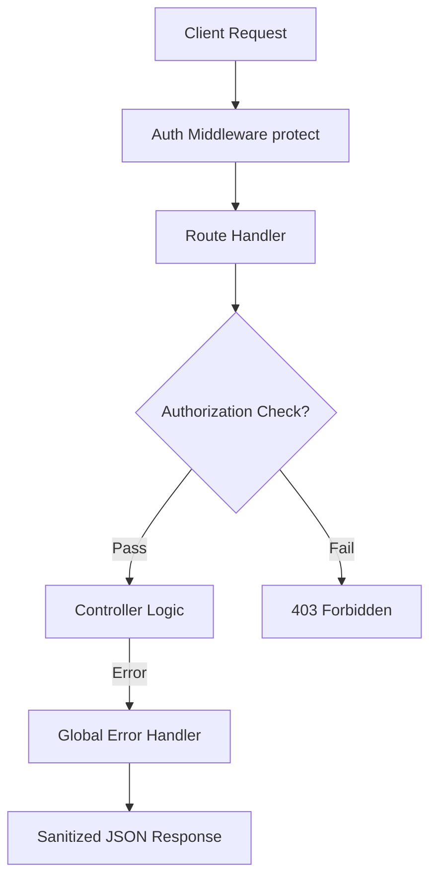

# 🛡️ Implementation Plan - Security Hardening & Universal Skeleton Loading

This plan maps out the step-by-step remediation of vulnerabilities (BOLA/IDOR/Authorization/Error Sanitization) in the backend and the implementation of a high-fidelity visual skeleton loading experience on all frontend pages.

---

## 🔒 Security Hardening (Backend)

We will address critical OWASP Top 10 vulnerabilities (A01: Broken Access Control, A10: Exceptional Conditions) by enforcing strict authorization checks and robust error boundary sanitization.

### 1. Centralized Error Handling Middleware
Exposing raw database and engine details in catches (like `res.status(500).json({ error })`) leaks system internals.
* **Remediation**:
  - Implement a `globalErrorHandler` middleware under `backend/src/middleware/errorMiddleware.ts`.
  - Sanitize responses based on `process.env.NODE_ENV` (mask stack traces and raw DB errors in production, returning clean generic error responses).

### 2. Broken Access Control (BOLA/IDOR) Enforcements
* **Profile Modification (`updateProfile`)**:
  - Enforce ownership checking (`req.user.id === req.params.id` or `req.user.role === 'admin'`).
  - Restrict the `role` field from being updated through standard profile updates to prevent unauthorized privilege escalation.
* **Event Operations (`updateEvent`, `deleteEvent`, `closeEvent`, `removeUserFromEvent`, `reAddUserToEvent`)**:
  - Enforce that the user performing the action is either the event organizer (`event.organizer`) or an `admin`.
* **Chat Access (`getChatById`, `fetchMessages`)**:
  - Verify the authenticated user is listed in the chat's `participants` array before returning chat logs or meta details.

---

## 🌀 Universal Skeleton Loading (Frontend)

We will craft a premium loading experience that completely avoids jarring, blank layouts by introducing shimmer-animated skeleton cards, charts, and details layouts.

### 1. Reusable Skeleton Primitives
* **`Skeleton` Base Component**: Add a sleek shimmer primitive inside `frontend/src/components/ui/skeleton.tsx` using Tailwind v4 shimmer animation tokens.
* **Page-Specific Skeletons**:
  - **`DiscoverySkeleton`**: Emulates cards with banners, titles, dynamic interest badges, and score circles.
  - **`DashboardSkeleton`**: Mimics dashboard statistics cards, radar chart containers, and side lists.
  - **`ProfileSkeleton`**: Pre-renders profile cover photo, avatar, bio text blocks, and tabs.
  - **`ChatSkeleton`**: Renders message history blocks and chat lists with avatars.
  - **`EventDetailsSkeleton`**: Pre-renders event banner placeholders, calendar/location card widgets, and organizer cards.

---

## Proposed Changes

### Backend Components



#### [NEW] [errorMiddleware.ts](file:///D:/BCVS_CBP/backend/src/middleware/errorMiddleware.ts)
* Create `errorHandler` middleware that intercepts express errors, logs them securely on the server side, and returns sanitized error payloads to the client.

#### [MODIFY] [index.ts](file:///D:/BCVS_CBP/backend/src/index.ts)
* Wire up `errorHandler` as the final middleware wrapper.

#### [MODIFY] [userController.ts](file:///D:/BCVS_CBP/backend/src/controllers/userController.ts)
* Enforce profile owner checks in `updateProfile`.
* Exclude modification of the privileged `role` field unless executed by an authenticated `'admin'`.

#### [MODIFY] [eventController.ts](file:///D:/BCVS_CBP/backend/src/controllers/eventController.ts)
* Enforce organizer or admin role verification for `updateEvent`, `deleteEvent`, `closeEvent`, `removeUserFromEvent`, and `reAddUserToEvent`.
* Clean up exposed catch errors, routing them to next callback.

#### [MODIFY] [chatController.ts](file:///D:/BCVS_CBP/backend/src/controllers/chatController.ts)
* Validate membership within `getChatById` and `fetchMessages` to ensure only chat participants can view messages and chat objects.

---

### Frontend Components

#### [NEW] [skeleton.tsx](file:///D:/BCVS_CBP/frontend/src/components/ui/skeleton.tsx)
* Standard reusable, premium styled shimmer block component.

#### [NEW] [PageSkeletons.tsx](file:///D:/BCVS_CBP/frontend/src/components/ui/PageSkeletons.tsx)
* Define pre-composed high-fidelity skeleton states for:
  - `DashboardSkeleton` (stat cards, radar widget, list mockups)
  - `DiscoverySkeleton` (relevance grid, search filter placeholders)
  - `EventDetailsSkeleton` (banner layout, tickets mockup)
  - `ChatSkeleton` (conversation thread list, message bubbles)
  - `ProfileSkeleton` (identity details, activity tabs)

#### [MODIFY] [Dashboard.tsx](file:///D:/BCVS_CBP/frontend/src/pages/Dashboard.tsx)
* Hook up `DashboardSkeleton` during metric and recommendation retrieval.

#### [MODIFY] [Discovery.tsx](file:///D:/BCVS_CBP/frontend/src/pages/Discovery.tsx)
* Integrate `DiscoverySkeleton` in the event loading states.

#### [MODIFY] [EventDetails.tsx](file:///D:/BCVS_CBP/frontend/src/pages/EventDetails.tsx)
* Add high-fidelity `EventDetailsSkeleton` while event content resolves.

#### [MODIFY] [Chat.tsx](file:///D:/BCVS_CBP/frontend/src/pages/Chat.tsx)
* Apply `ChatSkeleton` during active channel switching and socket message synchronization.

#### [MODIFY] [Profile.tsx](file:///D:/BCVS_CBP/frontend/src/pages/Profile.tsx)
* Render `ProfileSkeleton` during profile fetch.

---

## Verification Plan

### Automated Checks
* Execute the system verification:
  ```bash
  python .agent/scripts/verify_all.py
  ```
* Run local dev servers to verify compilation.

### Manual Verification
* Try sending an unauthorized `PUT` request with different user IDs to `updateProfile` to verify it denies access.
* Attempt accessing `/api/chats/:chatId/messages` using an unassociated user account to verify it denies access with a clean `403 Forbidden` response.
* Check visual layouts during state loads to ensure skeleton screens seamlessly match the finalized dynamic state blocks.
